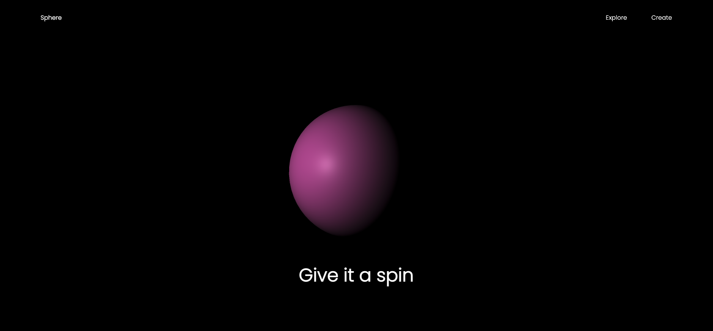

# Threejs Demo

This project is a basic example of a Threejs development. It demonstrates how to create a simple 3D sphere using Threejs and how to use the GreenSock Animation Platform (GSAP) to animate it. The sphere changes color when you hold your mouse button and move it around the page.

## Getting Started

To get started with this project, you can clone the repository or download the zip file. Once you have the project files, you will need to install the required dependencies by running `npm install` in your terminal. This will install Threejs and GSAP.

After the installation is complete, you can run the demo by opening `index.html` in your browser. You should see a 3D sphere on the page that you can interact with by holding down your mouse button and moving it around.

### Prerequisites

To run this project, you will need to have Threejs and GSAP installed on your machine. If you don't have them already, you can install them using `npm`:

`npm install three gsap`

## Usage

To use this demo, simply hold down your mouse button and move it around the page. The sphere will change color as you move your mouse.

## Screenshots

Here are some screenshots of the demo:

## Contributing

If you have any suggestions for how this project can be improved, please feel free to contribute! You can do this by submitting a pull request with your changes.

## Acknowledgments

This project was inspired by the Threejs documentation and the GreenSock website. Thanks to the creators of these tools for making it easier to build cool 3D animations on the web!
