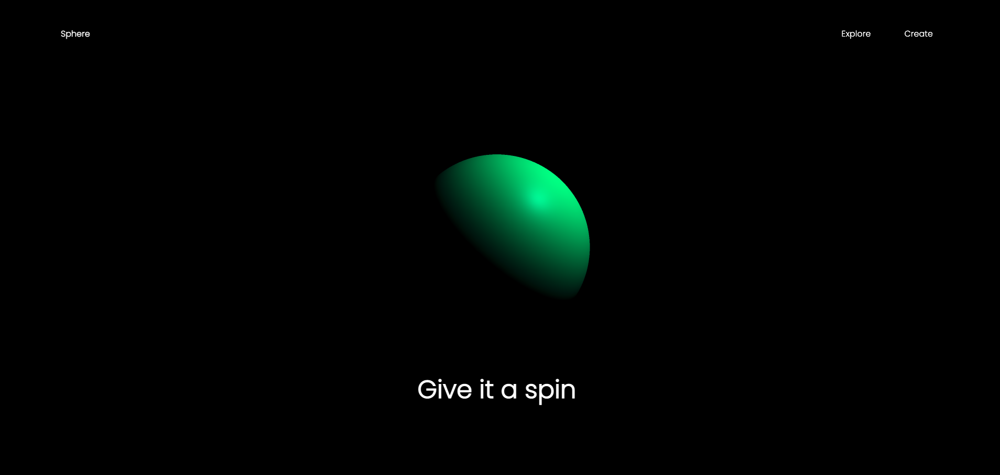

# Threejs Demo

This project is for learning purpose of threejs basic development

## Getting Started

You can clone or download the zip to get the project and then run npm install. after that run index.html

### Prerequisites

Threejs and gsap for animation
## Usage

hold your mouse button to change the color of the sphere again and again on different positions of page
## Screenshots

